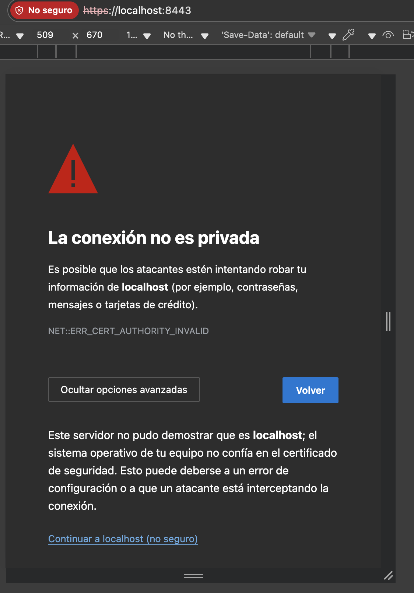
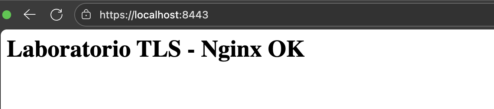

# Laboratorio práctico de TLS y mTLS

**Objetivo:** Laboratorio para alinear conceptos y, sobre todo, dejar comandos y checklists para diagnosticar incidencias asociadas a certificados.

**Requerimientos:** bash (Terminal), OpenSSL, Docker/Podman.

## Conceptos Clave

- **Llave privada:** secreto que firma; NO se comparte.
- **Llave pública:** se incluye en el certificado. Generado a partir de la llave privada. Matematicamente relacionados. Par asimetrico.
- **CSR (Certificate Signing Request):** lleva llave pública + atributos (CN/SAN) y firmado con la privada.
- **Certificado (X.509):** identifica sujeto (CN/SAN), tiene la llave pública, y esta firmado por CA, fechas, usos. Este puede obtenerse en respuesta al CSR.
- **Cadena:** servidor ⇒ intermedios ⇒ raíz (trust anchor). El cliente debe confiar en la raíz.
- **SAN:** Subject Alternative Name (FQDNs/IPs). Hoy prevalece sobre CN para validación de nombre.
- **Formatos:**
    - **PEM (.pem, .crt, .key):** base64 con headers -----BEGIN …-----.
    - **DER (.der):** binario.
- **Contenedores de certificados y llaves:** 
    - **PKCS#12 (.p12, .pfx):** contenedor con clave+cert+cadena (con contraseña).
    - **JKS:** keystore propietario de Java (hoy se prefiere PKCS12).
- **Modos TLS:**
    - **TLS unidireccional:** cliente valida servidor.
    - **mTLS (mutuo):** servidor y cliente se autentican con certificados.


## Paso a paso
### 1. Descargar repo y situarse en el laboratorio

```bash
#Descarga del repositorio a local
git clone git@github.com:nuamx/nmx-png-laboratorio-ti-depositos.git

#Situarse en la carpeta del laboratorio
cd nmx-png-laboratorio-ti-depositos/10-key-crt-tls-mtls
```

### 2. Crear una CA local, un certificado de servidor y uno de cliente.

A continuación se cuenta con un script completo, para generar todas las llaves privadas y publicas (key), certificados (crt), solicitudes de certificado (csr), certificados fimados por CA y paquetes necesarios (pem). **Consejo: Ejecutar paso a paso el script para entender cada proceso.**

```bash
./scripts/generar_certs.sh 
```

### 3. Implementación de un servidor web en nginx y un balanceador HAproxy con los certificados previamente creados.

En el directorio de docker encontraras el docker compose, asi como los dockerfile que describen la creación de cada contenedor, donde se referencian los archivos de configuración de cada componente, con la inclusión de los respectivos paquetes de certificados, creados previamente.

El siguiente comando, puede se ejecutado tanto en podman, como en docker:
```bash
docker compose -f docker/docker-compose.yml up --build
```

### 4. Comprueba los certificados, consumiento directamente el nginx con TLS.

A continuación, realizamos la validación haciendo uso de openssl client:

```bash
./scripts/validar_tls.sh
```

Tambien podemos valildarlo desde un navegador web, podemos proceder a intentar abrir la url https://localhost:8443. 



Nos arrojara posiblemente el anterior error de certificado, pero esto se debe, a que ha sido firmado por un CA local, en el cual el navegador no confia.

Debemos proceder entonces a agregar el certificado de la CA, con el cual fue firmado el certificado (***CA.crt** en /certs), al trustore del navegador, el cual podemos encontrar normalmente en:

***Configuración -> Sistema -> Certificados*** 

o consultar, para cada navegador particular. Posteriormente proceder a reiniciar la pagina y podremos obtener la confirmación de confianza como la siguiente:



### 5. Comprueba los certificados, consumiento directamente el HAproxy con mTLS.

A continuación, realizamos la validación haciendo uso de openssl client (adjuntando certificado del cliente): **Consejo: Ejecutar paso a paso el script para entender cada proceso.** 

```bash
./scripts/validar_mtls.sh
```
***Pendiente: Agregar pasos para validación por medio de navegador y postman**

### 6. Checklist para solución de errores con certificados.

Proximamente...
